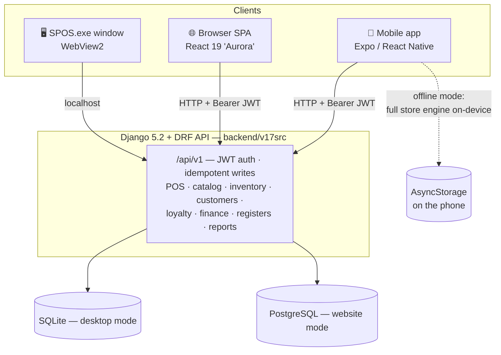
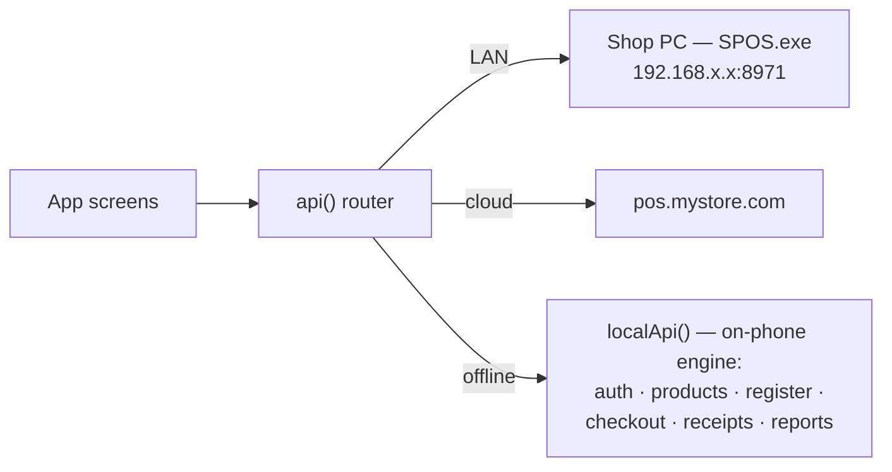
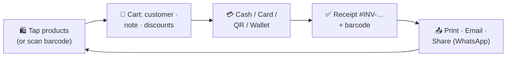
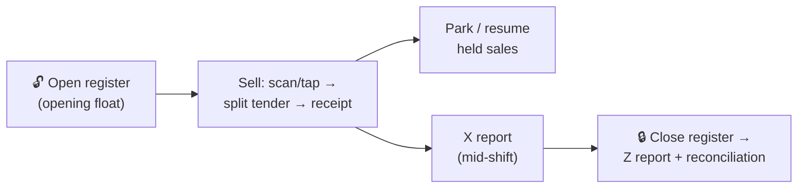
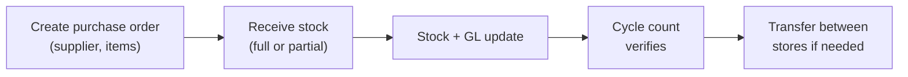
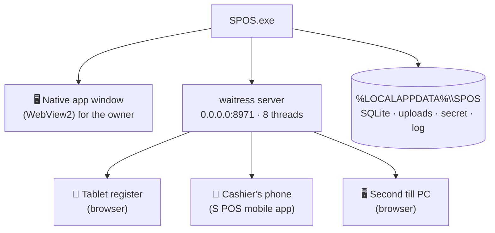
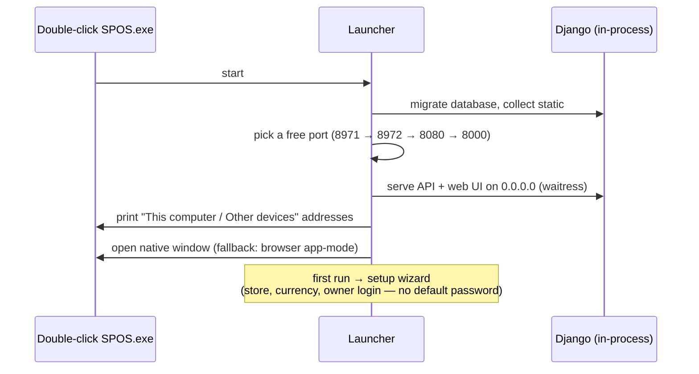
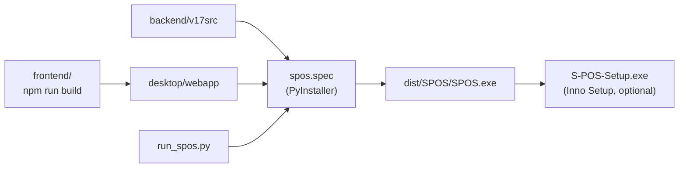
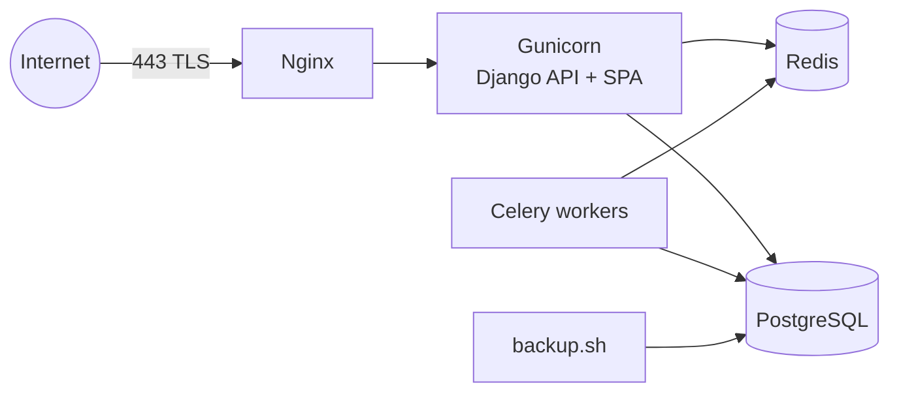
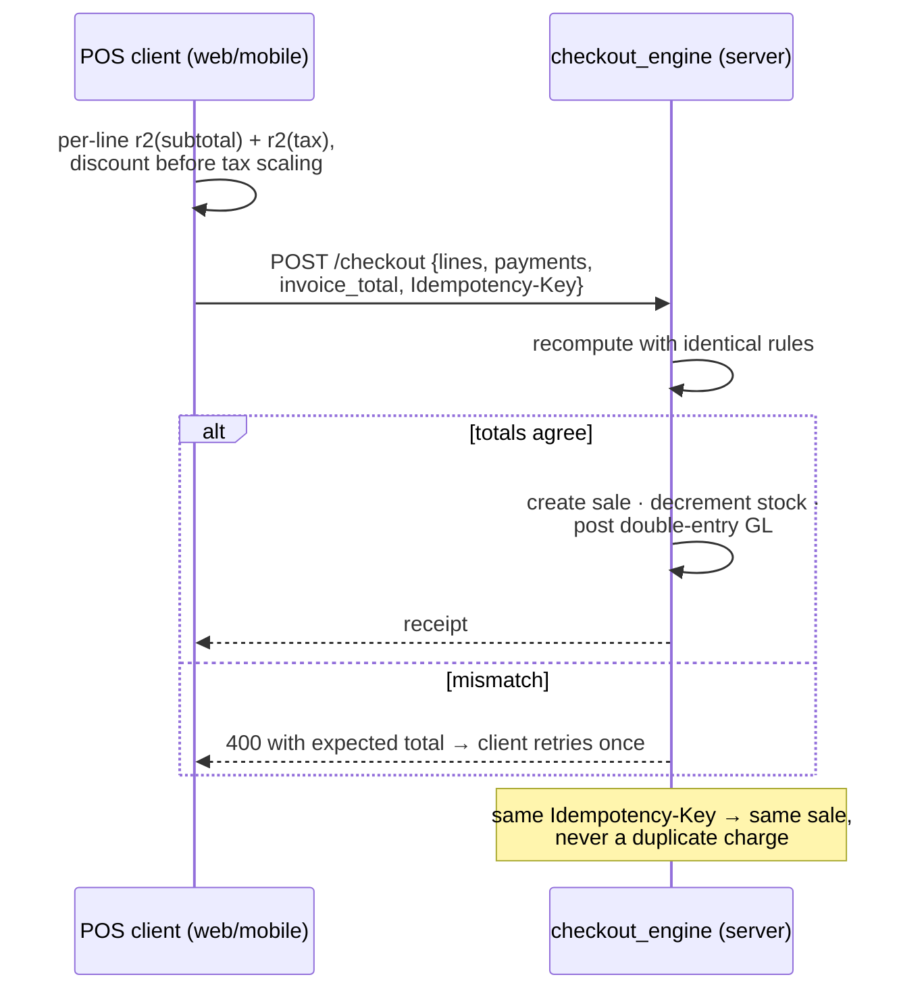

# S POS — Retail Point of Sale

**Developed by Sridhar Mahalingam.** A complete, multi-region, multi-currency point-of-sale
and back-office platform for shops of any size. One backend, **three ways to run your store**:

| 📱 Mobile app | 🖥️ Windows desktop app | 🌐 Website / SaaS |
|---|---|---|
| React Native (Expo). Sell from your phone or tablet — or run the **entire store on the phone, fully offline**, no computer needed. | Self-contained `SPOS.exe` (SQLite, nothing else to install). One PC runs it; tablets, phones and extra registers connect over the same Wi-Fi. | Dockerized Django + Postgres + Redis behind Nginx/TLS for a hosted store. |

---

## Contents

1. [System architecture](#1-system-architecture)
2. [📱 The mobile app — every screen](#2--the-mobile-app)
3. [🌐 The website / web UI — every module](#3--the-website--web-ui)
4. [🖥️ The Windows desktop app](#4--the-windows-desktop-app)
5. [☁️ Production deployment](#5-️-production-deployment)
6. [The checkout money path](#6-the-checkout-money-path)
7. [Quick start & documentation](#7-quick-start--documentation)

---

## 1. System architecture

Every client speaks the same `/api/v1` contract, so the store works identically
everywhere — and the mobile app can even *be* the server:



---

## 2. 📱 The mobile app

Three store modes from one Connect screen — including a **complete store with zero
servers**:



### Getting started
<p>
  
  
  
  
</p>

**Connect** (offline mode or type the store address) → **Offline setup** (store name,
14 currencies, owner login, optional sample products) → **Sign in** (auto-refreshing
tokens) → **Dashboard** — Sales / Orders / Profit / Customers cards with trends vs
yesterday, period picker, notification bell, quick actions.

### The selling loop — each arrow is one tap



<p>
  
  
  
  
</p>
<p>
  
  
  
  
</p>

- **Products** — photo cards, search by name/barcode/SKU, camera **barcode scanner**,
  category chips; tapping adds to cart (badges + View Cart bar).
- **Cart** — quantity steppers, swipe-left to remove, attach customer, note,
  0/5/10/15 % discount chips, live totals.
- **Payment** — Card (brand badges + manual entry), Cash, QR, Wallet tiles.
- **Receipt** — premium layout with invoice barcode; **Print / Email / Share**, then
  New Sale loops back.
- **Sales report** — updates instantly: hourly chart, avg. order, top sellers,
  recent orders.

### Management on the phone
<p>
  
  
  
  
</p>

**Add Product** (photo, selling+cost price, tax %, opening stock, low-stock alert,
auto-SKU, barcode) · **Orders** (filters, tap → full receipt) · **Inventory**
(In/Low/Out-of-stock, units left) · **Settings** (register **open/close with cash
reconciliation**, store profile, payment-method toggles, receipt settings, staff).
Plus Notifications, Customers, Categories, More menu — all 22 screens explained in
[docs/SCREENSHOTS.md](docs/SCREENSHOTS.md).

### On a tablet the app transforms
| Phone: grid + View Cart bar | Tablet: 3-pane POS — sidebar · grid · live cart |
|---|---|
|  |  |

---

## 3. 🌐 The website / web UI

The full back-office ("Aurora" design system) — served by a hosted deployment **and**
bundled inside the desktop app. Much deeper than the mobile app: variants, promotions,
purchasing, gift cards, loyalty, accounting, approvals, X/Z reports, multi-store.

### Overview & Point of Sale


**Overview** — welcome banner (Open Point of Sale / View reports / Live), stat cards
(Today's sales, Sales today, Low stock, All-time revenue), quick actions.


**Point of Sale** — the full till: register-session banner, **barcode/QR/SKU scan
box**, walk-in or named customer, price lists, cash rounding, custom items, stock
badges on every card, and a right rail with **split tender** (Cash/Card/QR/Bank/
Wallet), exact-cash helper, **Park/Held sales** and Complete sale.

### The cashier's day



### SELL — Sales · Customers · Gift Cards · Loyalty · Time Clock
| Sales | Customers |
|---|---|
|  |  |
| Gift Cards | Loyalty |
|  |  |


- **Sales** — every transaction, receipt reprint, **partial refunds** (item + quantity).
- **Customers** — CRM with loyalty balances, store credit, purchase history.
- **Gift Cards** — issue cards (code, amount, expiry) with server-enforced balances.
- **Loyalty** — points earn/redeem rules per customer.
- **Time Clock** — staff clock-in/out and shifts.

### CATALOG — Products · Categories · Variants · Promotions · Price Lists
| Products | Categories |
|---|---|
|  |  |
| Variants | Promotions |
|  |  |


- **Products** — cards with stock badge, SKU, price, edit/delete, add with photo.
- **Variants** — size/colour variants and **modifiers** per product.
- **Promotions** — discount rules applied server-side at checkout.
- **Price Lists** — alternate pricing per customer group or store.

### INVENTORY — Stock · Stock Counts · Transfers · Suppliers · Purchasing
| Stock | Stock Counts |
|---|---|
|  |  |
| Transfers | Suppliers |
| |  |




- **Stock** — real-time levels per store, adjustments, low-stock alerts.
- **Stock Counts** — cycle counting with variance report.
- **Transfers** — inter-store stock movement with in-transit tracking.
- **Suppliers / Purchasing** — supplier book, POs, partial receiving; totals stay
  server-authoritative.

### MONEY & REPORTS — Reports · Refunds · Expenses · Approvals · Reconciliation
| Reports | Refunds |
|---|---|
|  |  |
| Expenses | Approvals |
|  |  |


- **Reports** — filter by date/store/register/cashier: sales count, gross, tax,
  payments breakdown, **X report** (open shift) & **Z report** (day end), CSV export.
- **Refunds** — full or partial; every refund posts a **GL reversal**.
- **Expenses → Approvals** — spend requests flow through manager approval.
- **Reconciliation** — drawer counts matched against the **double-entry ledger**;
  over/short surfaced.

### STORE SETUP — Registers · Sessions · Cash Movements · Stores · Companies · Users · Tax Rates · Settings
| Registers | Sessions |
|---|---|
|  |  |
| Cash Movements | Users |
|  |  |
| Stores | Companies |
|  |  |
| Tax Rates | Settings |
|  |  |

- **Registers / Sessions / Cash Movements** — physical tills, their open/close
  sessions and paid-in/paid-out drawer movements.
- **Stores / Companies** — multi-store, multi-company, **each company with its own
  currency**.
- **Users** — Owner / Manager / Cashier / Inventory roles + PIN for overrides.
- **Tax Rates / Settings** — tax configuration and store settings.

### The website is responsive — phone & tablet browsers
<p>
  
  
  
  
</p>

Staff on the shop Wi-Fi just open the store address in any browser — zero installation.

---

## 4. 🖥️ The Windows desktop app

One `SPOS.exe` = server + till + back-office for the whole shop. **SQLite inside,
nothing else to install**, works with no internet forever.



What happens when the owner double-clicks it:



And how it's built and shipped:



The window it opens **is the website UI above** (section 3) — every screenshot there
is exactly what the desktop app shows, e.g.:


---

## 5. ☁️ Production deployment



`deploy/` contains the full Docker stack, `.env` template, Nginx TLS config and backup
scripts — from zero to a hosted multi-store SaaS. See [deploy/README.md](deploy/README.md)
and [deploy/DEPLOY.md](deploy/DEPLOY.md).

---

## 6. The checkout money path

Why totals are always right, on every client:



---

## 7. Quick start & documentation

```bash
# backend API
cd backend/v17src && python manage.py migrate && python manage.py runserver

# website UI
cd frontend && npm install && npm run dev      # http://localhost:5173

# mobile app
cd mobile && npm install && npx expo start     # scan QR with Expo Go
```

| Document | What's inside |
|---|---|
| [docs/INSTALL.md](docs/INSTALL.md) | Every install path: desktop exe, from source, website dev, mobile, production |
| [docs/WORKFLOW.md](docs/WORKFLOW.md) | Step-by-step workflows with screenshots |
| [docs/ARCHITECTURE.md](docs/ARCHITECTURE.md) | All system diagrams and data flow |
| [docs/SCREENSHOTS.md](docs/SCREENSHOTS.md) | Every page explained — phone, tablet, desktop, website-in-browser |
| [backend/README.md](backend/README.md) | Every API domain + checkout/auth diagrams |
| [frontend/README.md](frontend/README.md) | Every web module with screenshots |
| [mobile/README.md](mobile/README.md) | Every mobile screen with screenshots |
| [desktop/README.md](desktop/README.md) | Boot/LAN/build diagrams |
| [deploy/README.md](deploy/README.md) | Production stack |
| [docs/USER_GUIDE.md](docs/USER_GUIDE.md) | Day-to-day guide for staff |

## Security highlights
Admin-gated account creation, server-enforced stored-value balances, tenant scoping on
money paths, signed payment webhooks, password validators, refresh-token revocation,
discount caps, hardened production settings.

## License / attribution
© S POS · Developed by **Sridhar Mahalingam**.
