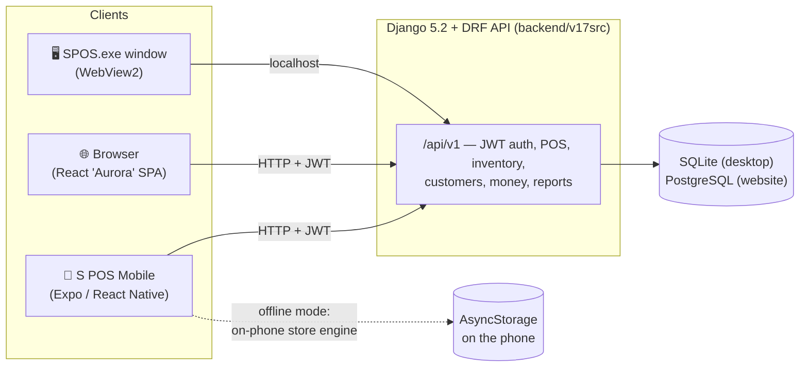

# S POS — Retail Point of Sale

**Developed by Sridhar Mahalingam.** A complete, multi-region, multi-currency point-of-sale
and back-office platform for shops of any size. One backend, **three ways to run your store**:

| 📱 Mobile app | 🖥️ Windows desktop app | 🌐 Website / SaaS |
|---|---|---|
| React Native (Expo). Sell from your phone or tablet — or run the **entire store on the phone, fully offline**, no computer needed. | Self-contained `SPOS.exe` (SQLite, nothing else to install). One PC runs it; tablets, phones and extra registers connect over the same Wi-Fi. | Dockerized Django + Postgres + Redis behind Nginx/TLS for a hosted store. |
| [`mobile/`](mobile/README.md) | [`desktop/INSTALL.md`](desktop/INSTALL.md) | [`deploy/DEPLOY.md`](deploy/DEPLOY.md) |

<p align="center">
  
  
  
  
</p>

<p align="center">
  
  
</p>

## Documentation

| Document | What's inside |
|---|---|
| [**INSTALL**](docs/INSTALL.md) | Every way to install & run: desktop exe, from source, website dev, mobile app, production deploy |
| [**WORKFLOW**](docs/WORKFLOW.md) | Step-by-step selling workflow with screenshots — products → cart → payment → receipt → share bill → sales report |
| [**ARCHITECTURE**](docs/ARCHITECTURE.md) | System diagrams (Mermaid), components, data flow, connection modes, checkout math |
| [**SCREENSHOTS**](docs/SCREENSHOTS.md) | Every page of the app explained — phone, tablet and desktop versions side by side |
| [User guide](docs/USER_GUIDE.md) | Day-to-day usage for shop staff |
| [Payments](docs/PAYMENTS.md) · [Privacy](docs/PRIVACY.md) · [Terms](docs/TERMS.md) | Policies |

## What it does
- **Point of Sale** — product-card grid, barcode/QR scan, split tender, line discounts & price
  overrides (manager-PIN), cash rounding, custom/open items, **product variants & modifiers**,
  parked sales, printable + emailed receipts with a **tax-invoice QR**.
- **Inventory** — real-time stock, purchases & partial receiving, inter-store transfers,
  **stock counts / cycle counting**, batches, serials, low-stock alerts.
- **Customers** — CRM, **loyalty**, **gift cards**, **store credit**, house credit accounts.
- **Money** — server-authoritative pricing/tax/promotions, **double-entry accounting**,
  reconciliation, refunds with GL reversal, expenses & approvals.
- **Reporting** — live dashboard, X/Z reports, sales by item/cashier/hour, CSV export.
- **People** — role-based access (Owner/Manager/Cashier/Inventory), PIN login, time clock/shifts.
- **Platform** — per-company currency (any country), first-run setup wizard, offline-ready UI,
  idempotent checkout, audit trail.
- **Mobile-only superpower** — *"Run my store on this phone"*: a complete on-device store engine
  (products, customers, register, checkout, receipts, reports) that works with **zero servers**.

## Repository layout — each component has its own detailed README

| Folder | Component | Detailed README |
|---|---|---|
| `backend/v17src` | Django API (shared by website + desktop + mobile) | [backend/README.md](backend/README.md) — every API domain + workflow diagrams |
| `frontend/` | React web UI — the "Aurora" design (website + desktop window) | [frontend/README.md](frontend/README.md) — every module with screenshots |
| `mobile/` | React Native (Expo) app — phone & tablet, incl. offline on-phone store | [mobile/README.md](mobile/README.md) — every screen with screenshots |
| `desktop/` | Windows app: launcher, build scripts, installer, bundled web UI | [desktop/README.md](desktop/README.md) — boot/LAN/build diagrams |
| `deploy/` | Production website stack (Docker, Nginx, backups) | [deploy/README.md](deploy/README.md) — stack diagram + workflow |
| `docs/` | Install, workflow, architecture, screenshots, user guide, policies | [docs/README.md](docs/README.md) — documentation index |

## Quick start (development)
```bash
# backend API
cd backend/v17src && python manage.py migrate && python manage.py runserver

# website UI
cd frontend && npm install && npm run dev      # http://localhost:5173

# mobile app
cd mobile && npm install && npx expo start     # scan QR with Expo Go
```
Full instructions, including the desktop `SPOS.exe` build and production deploy, are in
[docs/INSTALL.md](docs/INSTALL.md).

## Architecture at a glance

Deep dive with all diagrams: [docs/ARCHITECTURE.md](docs/ARCHITECTURE.md).

## Security highlights
Admin-gated account creation, server-enforced stored-value balances, tenant scoping on money paths,
signed payment webhooks, password validators, refresh-token revocation, discount caps, hardened
production settings. See [`deploy/DEPLOY.md`](deploy/DEPLOY.md) for the full checklist.

## License / attribution
© S POS · Developed by **Sridhar Mahalingam**.
