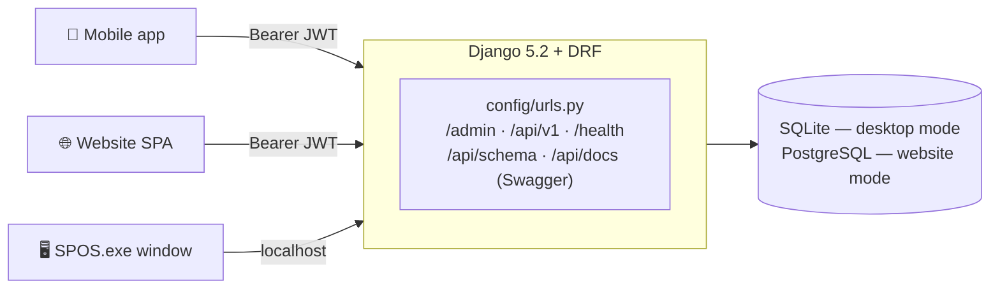
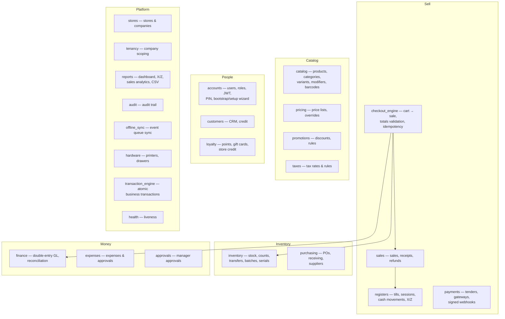
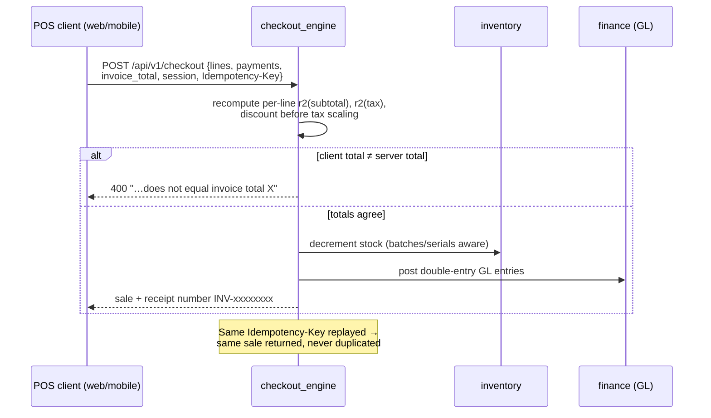
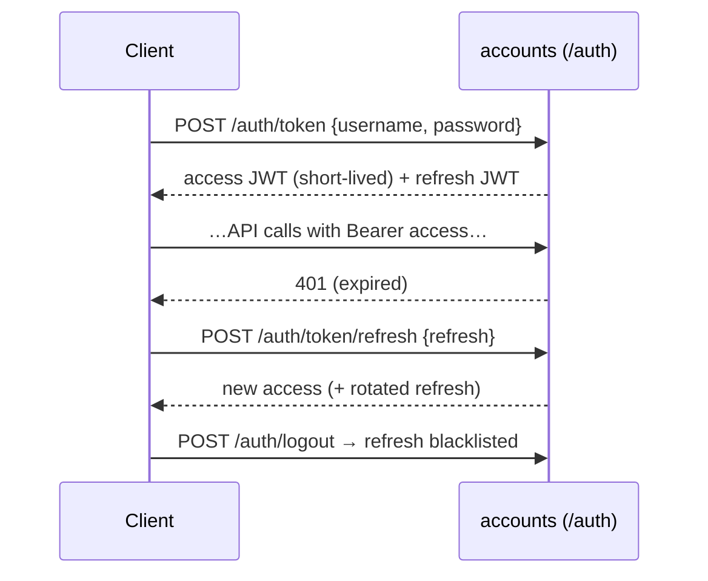

# S POS — Backend API (`backend/v17src`)

The single source of truth for every S POS client — the website, the Windows desktop
app and the mobile app all speak to this one API. **Django 5.2 + Django REST
Framework**, JWT auth (SimpleJWT), OpenAPI schema via drf-spectacular.

Developed by **Sridhar Mahalingam**.

---

## 1. How every client reaches it



- `/api/v1/…` — the versioned API (also mounted at `/api/…`).
- `/api/docs/` — **interactive Swagger UI**, `/api/schema/` — OpenAPI schema.
- `/health/` — liveness endpoint used by monitors and the desktop launcher.
- `/admin/` — Django admin for low-level maintenance.

## 2. Domain map — what each app does



### URL prefix → app (from `config/v1_urls.py`)

| Prefix | App | Functionality |
|---|---|---|
| `/api/v1/auth/` | accounts | Login (JWT pair), refresh, logout/blacklist, bootstrap first-run setup, users & roles, PIN |
| `/api/v1/stores/` | stores | Companies, stores, currency per company |
| `/api/v1/catalog/` | catalog | Products, categories, variants, modifiers, barcode lookup, images |
| `/api/v1/inventory/` | inventory | Stock levels, adjustments, stock counts, transfers, batches, serials, low stock |
| `/api/v1/customers/` | customers | CRM, house credit accounts |
| `/api/v1/purchasing/` | purchasing | Suppliers, purchase orders, (partial) receiving |
| `/api/v1/promotions/` | promotions | Promotion rules & application |
| `/api/v1/loyalty/` | loyalty | Loyalty points, gift cards, store credit |
| `/api/v1/registers/` | registers | Registers, open/close sessions, cash movements |
| `/api/v1/sales/` | sales | Sales list/detail, receipts, refunds (with GL reversal) |
| `/api/v1/checkout/` | checkout_engine | The checkout: validates totals, creates the sale atomically |
| `/api/v1/finance/` | finance | Double-entry ledger, reconciliation |
| `/api/v1/expenses/` | expenses | Expense tracking |
| `/api/v1/approvals/` | approvals | Manager approval workflow |
| `/api/v1/pricing/` | pricing | Price lists |
| `/api/v1/taxes/` | taxes | Tax rates |
| `/api/v1/reports/` | reports | Dashboard stats, sales by item/cashier/hour, X/Z, CSV export |
| `/api/v1/payments/` | payments | Payment providers, signed webhooks |
| `/api/v1/offline/` | offline_sync | Offline event queue ingestion |
| `/api/v1/transactions/` | transaction_engine | Atomic multi-step business transactions |
| `/api/v1/tenancy/` | tenancy | Company/tenant scoping |
| `/api/v1/audit/` | audit | Audit trail |
| `/api/v1/hardware/` | hardware | Receipt printers, cash drawers |
| `/api/v1/production/` | production_core | Production/readiness utilities |

## 3. The checkout workflow (the money path)



**Server-authoritative money**: pricing, promotions, tax, stored-value balances and
checkout totals are always computed here; clients only *estimate* for display.

## 4. Authentication workflow



First run: `/auth/bootstrap` powers the **setup wizard** — creates company, store,
currency and the owner account. There are **no default credentials**.
Roles: Owner / Manager / Cashier / Inventory; manager-PIN approves price overrides.

## 5. Running it

```bash
cd backend/v17src
pip install -r requirements.txt
python manage.py migrate
python manage.py runserver          # http://127.0.0.1:8000
```

| Env var | Effect |
|---|---|
| `NOVAPOS_DESKTOP=1` | Desktop mode: SQLite, LAN-friendly CORS |
| `NOVAPOS_DATA=<dir>` | Data folder (SQLite DB, uploads, secret key) |
| `NOVAPOS_WEBAPP=<dir>` | Also serve a built web UI (whitenoise) — how `SPOS.exe` ships one process |
| `DEBUG=False` | Production behaviour |

Tests live in `tests/` (`python manage.py test`).

## 6. Related documentation

- Big-picture architecture & diagrams → [`docs/ARCHITECTURE.md`](../docs/ARCHITECTURE.md)
- All install paths → [`docs/INSTALL.md`](../docs/INSTALL.md)
- The UI this API powers → [`frontend/README.md`](../frontend/README.md),
  [`mobile/README.md`](../mobile/README.md), [`desktop/README.md`](../desktop/README.md)

© S POS · Developed by **Sridhar Mahalingam**.
