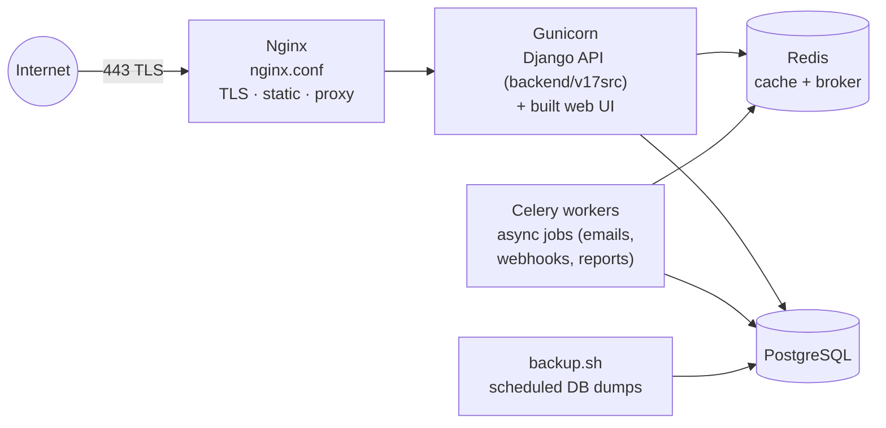
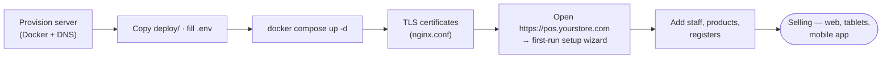

# S POS — Production Deployment (`deploy/`)

Everything needed to run S POS as a **hosted website / SaaS**. The step-by-step
checklist is in [`DEPLOY.md`](DEPLOY.md) — this README explains the stack.

Developed by **Sridhar Mahalingam**.

---

## 1. The stack



All composed by **`docker-compose.prod.yml`**; configuration comes from an `.env`
file based on **`.env.production.example`** (domain, `SECRET_KEY`, DB password,
email, payment keys…).

## 2. Files

| File | Purpose |
|---|---|
| `docker-compose.prod.yml` | The full stack: web, db, redis, celery, nginx |
| `nginx.conf` | TLS termination, static files, proxy to Gunicorn |
| `.env.production.example` | Template for all production settings — copy to `.env` |
| `backup.sh` | PostgreSQL backup script (schedule via cron) |
| `DEPLOY.md` | Step-by-step deployment + hardening checklist |

## 3. Quick start

```bash
cd deploy
cp .env.production.example .env      # fill in domain, secrets, DB password
docker compose -f docker-compose.prod.yml up -d
```

Then follow [`DEPLOY.md`](DEPLOY.md) for certificates, first-run setup wizard,
backups and the security checklist (DEBUG off, allowed hosts, signed webhooks,
password validators, refresh-token revocation…).

## 4. What a hosted store gets

The identical UI and API as the desktop app — see
[`frontend/README.md`](../frontend/README.md) (every page, with screenshots) and
[`backend/README.md`](../backend/README.md) (every API domain) — plus:

- **Any device, anywhere** — staff sign in from any browser; the mobile app connects
  with just the URL (`pos.yourstore.com`).
- **Multi-store / multi-company** — branches under one deployment, each with its own
  currency.
- **Async jobs** — Celery handles emails, webhooks and heavy reports off the request path.
- **Backups** — scripted Postgres dumps.

## 5. Workflow: from zero to selling online



© S POS · Developed by **Sridhar Mahalingam**.
