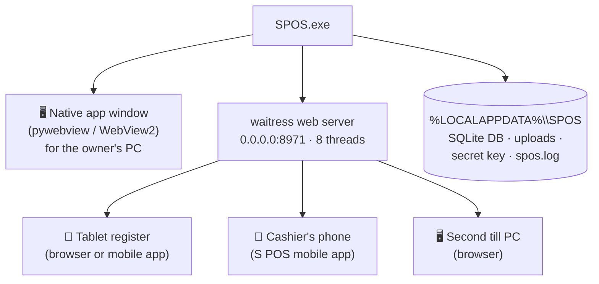
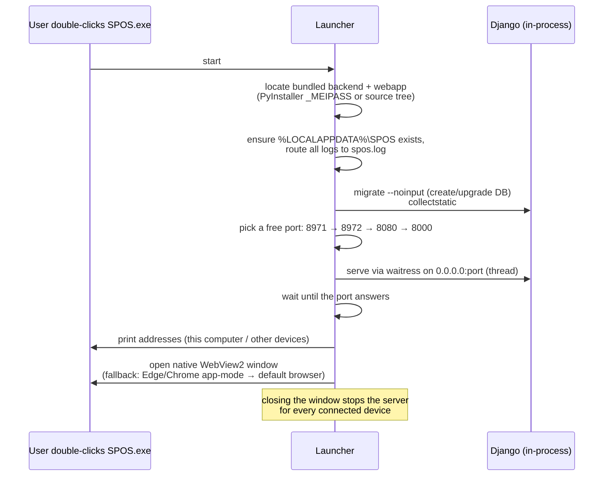
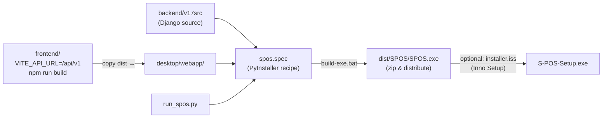

# S POS — Windows Desktop App (`desktop/`)

The shop-in-a-box: one `SPOS.exe` that is **server + till + back-office** for a whole
store. SQLite inside, nothing to install, and every tablet/phone/extra register on the
shop Wi-Fi connects to it. Install steps live in [`INSTALL.md`](INSTALL.md) — this
README explains how it works.

Developed by **Sridhar Mahalingam**.

---

## 1. What one exe gives the shop

- **Full functionality** — the bundled web UI is the complete "Aurora" back-office +
  POS ([`frontend/README.md`](../frontend/README.md) tours every page); the API inside
  is the complete Django backend ([`backend/README.md`](../backend/README.md)).
- **Offline by design** — no internet needed, ever. The Wi-Fi router is enough.
- **Multi-register** — other devices open `http://<PC-IP>:8971/` or point the
  **S POS mobile app** at that address.

## 2. Boot sequence (what `run_spos.py` does)

Other behaviours:
- **First run** → the web UI shows the **setup wizard** (store, currency, owner login).
  No default account is shipped.
- **Update check** — if `SPOS_UPDATE_URL` is set, a JSON manifest is polled and a
  newer version is announced at startup (current `APP_VERSION = 1.0.0`).
- **Custom data folder** — set `SPOS_DATA` to move the database elsewhere (e.g. a
  synced folder).

## 3. Build pipeline

## 4. Files in this folder

| File | Purpose |
|---|---|
| `run_spos.py` | Launcher — boots the backend, serves the LAN, opens the window |
| `Start-S-POS.bat` | Run from source (needs Python 3.11+) |
| `build-exe.bat` | Build the standalone `SPOS.exe` |
| `spos.spec` | PyInstaller build recipe |
| `installer.iss` | Inno Setup script for a one-file installer |
| `requirements-desktop.txt` | Extra packages (waitress, pywebview, pyinstaller, whitenoise) |
| `webapp/` | Pre-built web UI served by the app |

## 5. The screens it serves

All captured in the full tour — [`docs/SCREENSHOTS.md`](../docs/SCREENSHOTS.md):
Overview dashboard, Point of Sale (split tender, park/hold, register sessions),
Sales, Customers, Gift Cards, Loyalty, Time Clock, Products, Categories, Variants,
Promotions, Price Lists, Stock, Stock Counts, Transfers, Suppliers, Purchasing,
Reports (X/Z), Refunds, Expenses, Approvals, Reconciliation, Registers, Sessions,
Cash Movements, Stores, Companies, Users, Tax Rates, Settings.

| Overview | Reports |
|---|---|
|  |  |

## 6. Troubleshooting

- **Other devices can't connect** → allow `SPOS.exe` through Windows Firewall
  (Private networks); same Wi-Fi required.
- **Window doesn't open** → the server still runs; open `http://127.0.0.1:8971/` manually.
- **Reset everything** → delete `%LOCALAPPDATA%\SPOS` (recreated on next launch).
- **Logs** → `%LOCALAPPDATA%\SPOS\spos.log` captures all output of the windowed exe.

© S POS · Developed by **Sridhar Mahalingam**.
