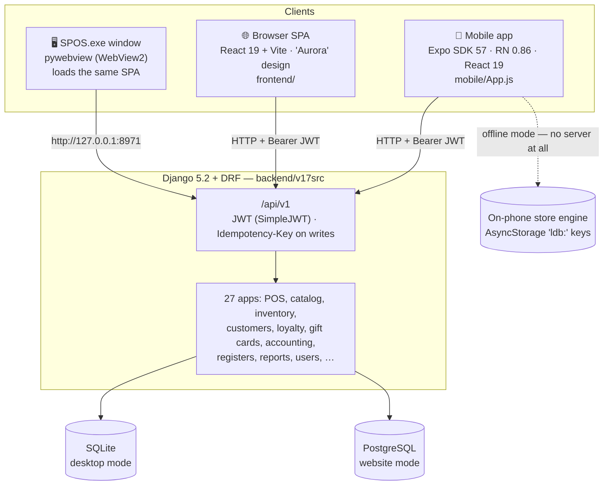
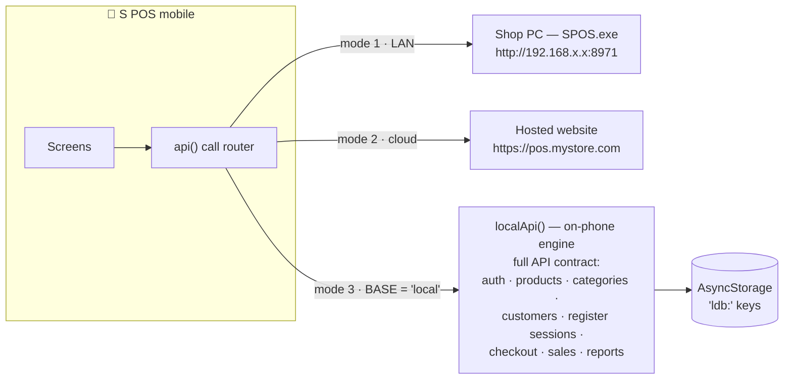
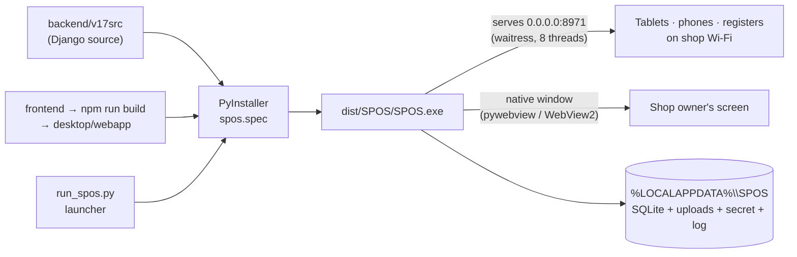
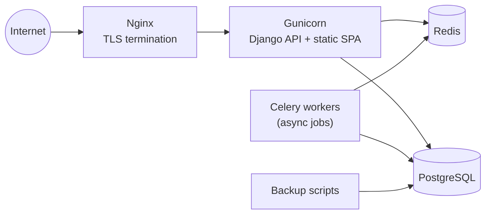
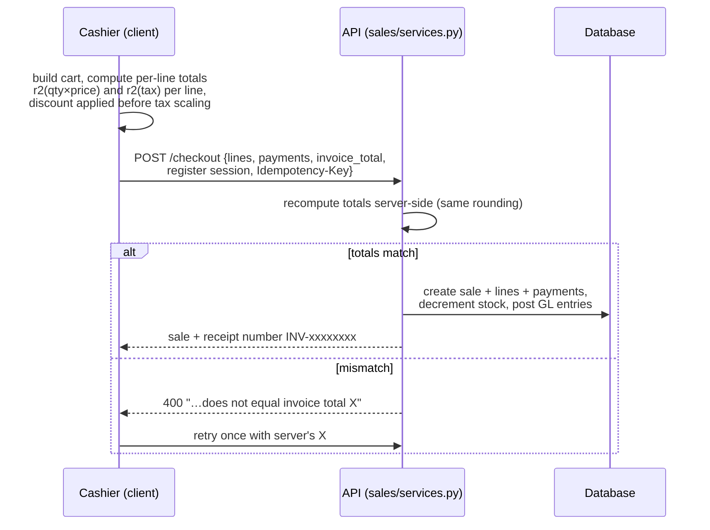

# S POS — Architecture

How the platform fits together: one Django backend, one React web UI, one React Native
mobile app, three deployment shapes (desktop exe, hosted website, phone-only offline).

**Contents**
1. [System overview](#1-system-overview)
2. [Components](#2-components)
3. [The three store modes (mobile)](#3-the-three-store-modes-mobile)
4. [Desktop app packaging](#4-desktop-app-packaging)
5. [Production website stack](#5-production-website-stack)
6. [Checkout flow & money math](#6-checkout-flow--money-math)
7. [Authentication](#7-authentication)
8. [Data storage](#8-data-storage)

---

## 1. System overview

Key property: **every client speaks the same `/api/v1` contract.** The mobile app's
offline engine implements that same contract locally, which is why the app code doesn't
care whether the "server" is a shop PC, a cloud site, or the phone itself.

## 2. Components

| Component | Path | Tech | Role |
|---|---|---|---|
| Backend API | `backend/v17src` | Django 5.2, DRF, SimpleJWT | Source of truth: catalog, stock, money, users, reports |
| Web UI | `frontend/` | React 19, Vite, "Aurora" design system | Full back-office + Point of Sale in the browser |
| Mobile app | `mobile/` (single `App.js`) | Expo SDK 57, RN 0.86, React 19 | Phone/tablet POS + offline store engine |
| Desktop launcher | `desktop/run_spos.py` | waitress, pywebview, PyInstaller | Boots API + serves web UI + opens native window |
| Deploy stack | `deploy/` | Docker: Gunicorn, Nginx, Postgres, Redis, Celery | Hosted website / SaaS |

## 3. The three store modes (mobile)

- **Mode 1 — Shop PC:** the phone is an extra register for a desktop-app store on the
  same Wi-Fi.
- **Mode 2 — Hosted:** same thing against a cloud deployment.
- **Mode 3 — On-phone:** `localApi()` implements the whole store on the device —
  salted SHA-256 login (expo-crypto), sequential `INV-…` numbering, register sessions
  with cash reconciliation, and **checkout math identical to the server's** (see §6).
  Verified end-to-end: setup → sale → receipt with zero servers.

## 4. Desktop app packaging

The launcher migrates the DB on start, picks a free port (8971 → 8972 → 8080 → 8000),
serves API + built web UI from one process, and opens a chromeless window (falls back to
Edge/Chrome app-mode, then the default browser). First run shows the setup wizard —
**no default credentials are shipped**.

## 5. Production website stack

Everything is composed in `deploy/docker-compose.yml` with an `.env` template;
see [`deploy/DEPLOY.md`](../deploy/DEPLOY.md).

## 6. Checkout flow & money math

Rules that keep every client and the server in perfect agreement:
- **Round per line, not per cart:** each line's subtotal and tax are rounded to
  2 decimals (`r2`) before summing.
- **Discount first, then tax scaling.**
- The client sends its computed `invoice_total`; the server is authoritative and
  rejects mismatches — the mobile app parses the server's expected value and retries once.
- **Idempotency-Key on every non-GET request** — a flaky tap can't double-charge a sale.

## 7. Authentication

- JWT (SimpleJWT): short-lived access token + refresh token; refresh-token blacklist
  on logout.
- The mobile `api()` wrapper **auto-refreshes on 401** and retries the request once.
- Public endpoints (`/auth/bootstrap`, `/auth/token/`) are called **without** an
  Authorization header (a stale token would otherwise 401 an AllowAny endpoint).
- Roles: Owner / Manager / Cashier / Inventory; manager-PIN gates price overrides
  and discounts at the till.

## 8. Data storage

| Mode | Store data | Notes |
|---|---|---|
| Desktop | `%LOCALAPPDATA%\SPOS\` — SQLite file, uploads, secret key, `spos.log` | Survives app updates; delete folder to factory-reset |
| Website | PostgreSQL + volume-mounted media | Backed up by `deploy/` scripts |
| Phone-only | AsyncStorage `ldb:` keys on the device | Cleared by uninstalling the app |
| Mobile session | JWT + server address in AsyncStorage | Sign out clears tokens |
