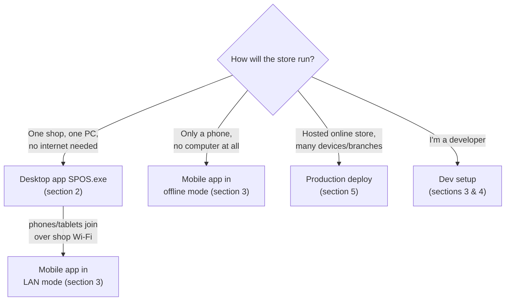

# S POS — Installation Guide

Every way to install and run S POS, from "shop owner double-clicks an exe" to a full
production cloud deployment.

**Contents**
1. [Which option do I want?](#1-which-option-do-i-want)
2. [Windows desktop app (`SPOS.exe`)](#2-windows-desktop-app-sposexe)
3. [Mobile app (phone / tablet)](#3-mobile-app-phone--tablet)
4. [Website — development setup](#4-website--development-setup)
5. [Website — production deployment](#5-website--production-deployment)
6. [Ports & credentials reference](#6-ports--credentials-reference)
7. [Troubleshooting](#7-troubleshooting)

---

## 1. Which option do I want?



---

## 2. Windows desktop app (`SPOS.exe`)

The self-contained shop server + till. **SQLite database, no PostgreSQL, no Redis,
no Node — nothing else to install.** Data lives in `%LOCALAPPDATA%\SPOS`.

### For a shop owner (finished build)
1. Copy the built `SPOS` folder anywhere (or run the `S-POS-Setup.exe` installer).
2. Double-click **`SPOS.exe`**.
3. First run shows a **setup wizard** — store name, currency, owner login (no default password).
4. The console window prints the addresses:
   ```
   This computer : http://127.0.0.1:8971/
   Other devices : http://192.168.1.20:8971/   (same Wi-Fi)
   ```
5. Tablets / phones / extra registers on the same Wi-Fi open the **Other devices**
   address in a browser — or use the **mobile app** pointed at that address.
6. Closing the window stops the server for every connected device.

### Run from source (needs Python 3.11+)
```
cd desktop
Start-S-POS.bat        # first run installs requirements, then launches
```

### Build the standalone exe
```
cd frontend
set VITE_API_URL=/api/v1
npm install && npm run build          # then copy frontend\dist → desktop\webapp

cd ..\desktop
build-exe.bat                         # or: pyinstaller --noconfirm spos.spec
```
Result: `desktop\dist\SPOS\` — zip and distribute. Optionally wrap with Inno Setup
(`installer.iss`) for a one-file installer. Full details: [`desktop/INSTALL.md`](../desktop/INSTALL.md).

---

## 3. Mobile app (phone / tablet)

Located in [`mobile/`](../mobile/README.md). Requires [Node.js](https://nodejs.org) and the
free **Expo Go** app (App Store / Google Play).

```bash
cd mobile
npm install
npx expo start          # add --tunnel if your Wi-Fi blocks device connections
```
Scan the QR code with **Expo Go** (Android) or the Camera app (iOS).

On first launch the app asks how to run:

| Mode | What to do | Needs |
|---|---|---|
| **Run my store on this phone** | Tap it, fill the setup form — done. Fully offline store on the phone. | Nothing else |
| **Shop PC (desktop app)** | Enter the PC's address, e.g. `192.168.1.20:8971` | `SPOS.exe` running, same Wi-Fi |
| **Hosted website** | Enter your store URL, e.g. `pos.mystore.com` | Deployed website (section 5) |

The address is normalised automatically (`http://` and `/api/v1` optional).

### Standalone APK / iOS build (optional)
```bash
npm install -g eas-cli
eas build -p android      # or: -p ios
```

### Web preview for developers
The same app renders in a browser via react-native-web:
```bash
npx expo start            # then open http://localhost:8081/?phone
```
`?phone` shows a 390 px phone frame; without it you get the responsive tablet/desktop layout.

---

## 4. Website — development setup

Backend API (Django 5.2, `backend/v17src`):
```bash
cd backend/v17src
pip install -r requirements.txt
python manage.py migrate
python manage.py runserver              # http://127.0.0.1:8000
```

Frontend SPA (React 19 + Vite, `frontend/`):
```bash
cd frontend
npm install
npm run dev                             # http://localhost:5173
```

Useful backend environment variables:

| Variable | Effect |
|---|---|
| `NOVAPOS_DESKTOP=1` | Desktop mode: SQLite, relaxed CORS for LAN devices |
| `NOVAPOS_DATA=<dir>` | Where the SQLite DB / uploads / secret live |
| `NOVAPOS_WEBAPP=<dir>` | Serve a built web UI from the same server (needs `whitenoise`) |
| `DEBUG=False` | Production behaviour |

---

## 5. Website — production deployment

The [`deploy/`](../deploy) folder contains the full Docker stack:
**Gunicorn + Nginx (TLS) + PostgreSQL + Redis + Celery**, an env template and backup scripts.

```bash
cd deploy
cp .env.example .env      # fill in domain, secrets, DB password
docker compose up -d
```
Follow [`deploy/DEPLOY.md`](../deploy/DEPLOY.md) for the complete checklist
(certificates, backups, hardening).

---

## 6. Ports & credentials reference

| Port | Used by |
|---|---|
| **8971** | Desktop app (`SPOS.exe`) — API + web UI, serves the LAN. Falls back to 8972/8080/8000 if busy. |
| **8000** | Backend dev server (`manage.py runserver`) |
| **5173** | Frontend dev server (Vite) |
| **8081** | Expo Metro bundler (mobile dev + web preview) |
| **80/443** | Production Nginx |

There are **no default credentials** — the first-run setup wizard creates the owner
account. Change any demo/testing password before real use.

---

## 7. Troubleshooting

- **Other devices can't reach the desktop app** → allow `SPOS.exe` through Windows
  Firewall for *Private* networks; confirm all devices share the same Wi-Fi.
- **Expo Go can't connect to Metro** → restart with `npx expo start --tunnel`
  (works even when the firewall blocks inbound connections).
- **"Python is required"** → install Python 3.11+ with *Add python.exe to PATH* ticked.
- **Reset the desktop app completely** → delete `%LOCALAPPDATA%\SPOS` (recreated on next launch).
- **Mobile app stuck on splash after switching servers** → sign out (More ▸ Log Out) or
  reinstall; in the browser preview run `localStorage.clear()`.
