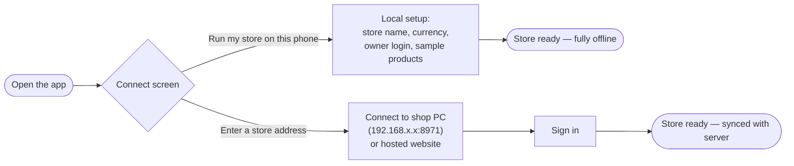
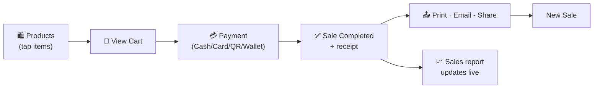
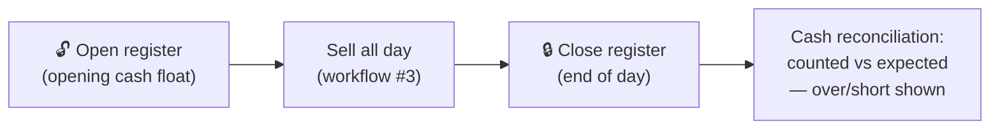

# S POS — Workflows (with screenshots)

Real screenshots from the app (phone size 390×844) showing each workflow from start to
finish. Every desktop-size page is covered in [SCREENSHOTS.md](SCREENSHOTS.md).

**Contents**
1. [First launch: choose how to run the store](#1-first-launch-choose-how-to-run-the-store)
2. [Sign in](#2-sign-in)
3. [The selling workflow: products → cart → payment → receipt → share → report](#3-the-selling-workflow)
4. [Adding a product](#4-adding-a-product)
5. [Orders & order history](#5-orders--order-history)
6. [Register: open, sell, close the day](#6-register-open-sell-close-the-day)
7. [Back-office: customers, inventory, categories, settings](#7-back-office)

---

## 1. First launch: choose how to run the store

| Connect screen | Offline store setup |
|---|---|
|  |  |

- **Connect screen** — two choices: *Run my store on this phone* (no computer needed,
  works fully offline) or *connect to a server* by typing the shop PC / website address.
- **Offline store setup** — one form: store name, currency (14 currencies), owner
  username + password, and an optional toggle to add sample products so you can explore.
  After this, the phone **is** the store: products, register, checkout, receipts and
  reports all live on the device.

## 2. Sign in

| Login |
|---|
|  |

When connected to a server that's already set up, you get a simple **Welcome back**
sign-in (username + password, show/hide password). Tokens refresh automatically —
you stay signed in day to day.

---

## 3. The selling workflow

The complete flow a cashier repeats all day — each arrow is one tap:

### Step 1 — Pick products
| Products grid | Items picked → cart bar appears |
|---|---|
|  |  |

Photo cards with name and price, **search by name / barcode / SKU**, category chips
(All, Grocery, Beverages…), and a **camera barcode scan** button. Tapping a product adds
it to the cart — a badge shows the quantity on each card and a blue **View Cart** bar
slides up with the running item count and total.

### Step 2 — Review the cart
| Cart |
|---|
|  |

Quantity steppers per line, **swipe left to remove** an item, attach a **customer**,
add an optional **note**, and one-tap **discount** chips (0 / 5 / 10 / 15 %).
Subtotal, tax and total update live. **Proceed to Payment** when ready.

### Step 3 — Take payment
| Card | Cash |
|---|---|
|  |  |

Four payment tiles — **Card, Cash, QR Code, Wallet**. Card shows the tap/insert/swipe
panel (VISA / MC / AMEX / DISCOVER) with a manual-entry fallback; Cash reminds the
cashier to collect and give change. One tap on **Confirm … Payment** completes the sale.

### Step 4 — Sale completed: the receipt
| Receipt | Share the bill |
|---|---|
|  |  |

A premium receipt: store name, date/time, **receipt number (#INV-…)**, cashier, payment
method, itemised lines, subtotal + tax + total, and a scannable **barcode** of the
invoice number.

**Bill sharing** — right under the receipt:
- 🖨️ **Print Receipt** — prints via the system print dialog (expo-print)
- ✉️ **Email Receipt** — opens an email with the receipt
- 📤 **Share Receipt** — WhatsApp or any share target on the phone
- **New Sale** — jump straight back to the products grid for the next customer

### Step 5 — Watch it land in the Sales report
| Sales report |
|---|
|  |

The **Sales** tab updates instantly: today's revenue, an **hourly sales chart**,
order count and average order value, **Top Selling Products** (with units sold and
revenue each), and **Recent Orders**. The period selector switches Today / other ranges.
The **Home** dashboard cards (Sales, Orders, Profit, Customers) update too:

| Home dashboard | Notifications |
|---|---|
|  |  |

The bell opens **Notifications** — a live feed of completed sales (tap one to open its
receipt) and low-stock alerts.

---

## 4. Adding a product

| Products → “+ Add Product” | The form |
|---|---|
|  |  |

Everything on one screen: **photo upload**, name, **selling price and cost price**
(profit tracking), category chips, **tax %**, **opening stock**, **low-stock alert**
threshold, **SKU (auto-generated if empty)** and **barcode (scan or type)**.
**Save Product** puts it on the grid immediately.

---

## 5. Orders & order history

| Orders list | Order detail |
|---|---|
|  |  |

**More ▸ Orders** lists every sale with filter chips (All / Completed / Pending /
Refunded), invoice number, date, item count, amount and status. Tapping an order opens
the **full receipt view** with its barcode — re-print or re-share any past bill.

---

## 6. Register: open, sell, close the day

| Settings — register control |
|---|
|  |

**More ▸ Settings** shows the register card with its live status (● open). At day end,
**Close register (end of day)** asks for the counted cash and reports over/short against
the expected drawer — the same X/Z discipline as the desktop Point of Sale.

---

## 7. Back-office

| Customers | Inventory | Categories |
|---|---|---|
|  |  |  |

- **Customers** — searchable list with **+ Add** (name/phone/email), purchase stats per customer.
- **Inventory** — live stock per product with **In Stock / Low Stock / Out of Stock**
  filters and remaining units ("120 left").
- **Categories** — create and organise categories; tap one for its product list.

| Settings (top) | Settings (rest) | More menu |
|---|---|---|
|  |  |  |

**Settings** covers Store Profile (name/address/phone on receipts), **Payment Methods**
(enable/disable tiles at checkout), **Receipt Settings** (footer message etc.),
**Users & Staff**, **App Preferences** (haptics), and Help & Support.
The **More** tab is the hub: Orders, Customers, Inventory, Categories, Settings,
About (version) and Log Out.
