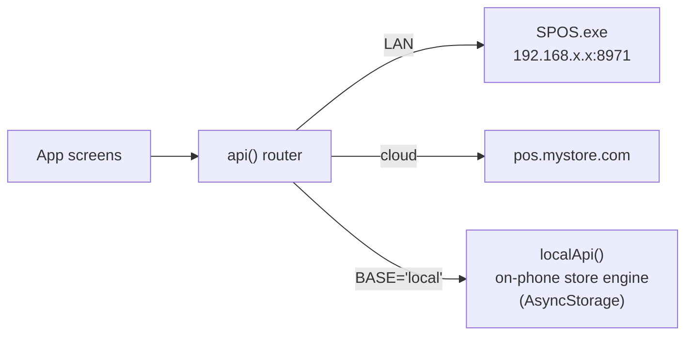
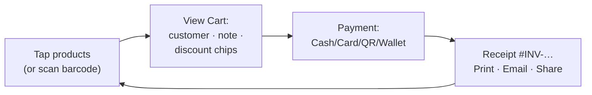

# S POS — Mobile App (`mobile/`)

The S POS store in your pocket. One app, three ways to run a shop:

1. **Run my store on this phone** — a complete store engine **on the device**:
   products, customers, register, checkout, receipts and reports with **zero servers,
   fully offline**.
2. **Shop PC** — connect to the Windows desktop app (`SPOS.exe`) over the shop Wi-Fi
   and use the phone as an extra register.
3. **Hosted website** — connect to your cloud store URL.

Built with **Expo SDK 57 / React Native 0.86 / React 19** — a single `App.js`.
Clean iOS-style light theme (blue `#2f6bff`), spring press animations, count-up
totals and haptics. Developed by **Sridhar Mahalingam**.



---

## Every screen, explained

📚 Bigger versions of every image with more detail: [docs/SCREENSHOTS.md](../docs/SCREENSHOTS.md) ·
step-by-step flows: [docs/WORKFLOW.md](../docs/WORKFLOW.md)

### Getting started
| Connect | Offline setup | Login |
|---|---|---|
|  |  |  |

- **Connect** — pick offline mode or type the store address (`http://` / `/api/v1` optional — it's normalised).
- **Offline setup** — store name, currency (14 choices), owner login, optional sample products.
- **Login** — for server stores; tokens auto-refresh so you stay signed in.

### Home
| Dashboard | Notifications |
|---|---|
|  |  |

Sales / Orders / Profit / Customers cards with **trends vs yesterday**, period picker,
quick actions, and a live notification feed (sales + low-stock alerts).

### Selling
| Products | Cart | Payment | Receipt |
|---|---|---|---|
|  |  |  |  |



- **Products** — photo cards, search by name/barcode/SKU, camera **barcode scanner**,
  category chips, **Add Product** (photo, selling+cost price, tax %, opening stock,
  low-stock alert, auto-SKU, barcode).
- **Cart** — steppers, swipe-left to delete, customer, note, 0/5/10/15 % discounts.
- **Payment** — method tiles; card brand badges + manual entry; cash panel.
- **Receipt** — premium layout with invoice barcode; **Print / Email / Share
  (WhatsApp etc.)**; New Sale loops back for the next customer.

### Reports & management
| Sales | Orders | Inventory | Settings |
|---|---|---|---|
|  |  |  |  |

- **Sales** — today's total, hourly chart, avg. order, top sellers, recent orders.
- **Orders** — history with All/Completed/Pending/Refunded filters; tap → full receipt.
- **Customers / Inventory / Categories** — CRM with add, stock filters
  (In/Low/Out, "120 left"), category management.
- **Settings** — **register open/close with cash reconciliation**, store profile,
  payment-method toggles, receipt settings, staff, haptics, help.

### Tablet layout
| Phone | Tablet (same app) |
|---|---|
|  |  |

On a big screen the app rearranges into a **3-pane POS**: sidebar navigation, product
grid, and an always-visible cart panel.

---

## Run it

You need [Node.js](https://nodejs.org) and the **Expo Go** app on your phone.

```bash
cd mobile
npm install
npx expo start            # add --tunnel if your Wi-Fi blocks direct connections
```

Scan the QR code with **Expo Go** (Android) or the Camera app (iOS).

> Tip: if the desktop app is the server, allow port **8971** through Windows Firewall
> for private networks. Find the PC's IP with `ipconfig`.

### Browser preview (developers)
Open `http://localhost:8081/?phone` for a 390 px phone frame, or without `?phone`
for the responsive tablet layout (react-native-web).

### Build installable apps (optional)
```bash
npm install -g eas-cli
eas build -p android      # or: -p ios
```

---

## Technical notes

- **Auth** — JWT (Bearer); `api()` auto-refreshes on 401 and never sends a stale token
  to public endpoints. Sign out clears tokens.
- **Money math** — mirrors the server exactly: per-line 2-decimal rounding, discount
  before tax scaling; on a rare mismatch the app adopts the server's total and retries once.
- **Idempotency** — every non-GET request carries an `Idempotency-Key`; a flaky tap
  can't double a sale.
- **Offline mode** — `localApi()` implements the full `/api/v1` contract on
  AsyncStorage (`ldb:` keys) with salted SHA-256 login via expo-crypto, sequential
  `INV-…` numbering and register sessions with cash reconciliation.
- Currency follows the store you connect to (QAR, USD, EUR, INR, AED, …).

© S POS · Developed by Sridhar Mahalingam
